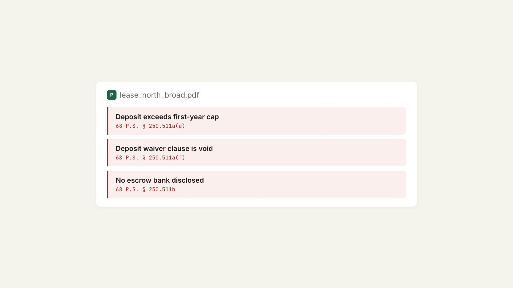

<div align="center">

# CasaVault

**Upload your lease. Know your rights.**

Every answer cites a source. Every refusal routes to a human.

[casavault.vercel.app](https://casavault.vercel.app)

---

**LexHack 2026** · Access to Justice & Civic Tech

</div>

<br>

<p align="center">
  
</p>

<br>

## Why this exists

In Philadelphia housing court, **87% of landlords have a lawyer**. Only **16% of tenants do**.

They don't lose because they're wrong — they lose because they can't prove it.

Philadelphia's Right to Counsel program covers roughly ten zip codes. Every renter outside them walks into court alone, with no documentation of the repair requests they made, the notices they received, or the condition of their unit.

CasaVault gives them a record that knows what the law says.

---

## What it does

Upload a document. CasaVault checks every clause against **9 verified Pennsylvania and Philadelphia statutes** and cites the exact section behind each finding — or tells you what information is still missing.

```
document ──> extractor (Gemini, schema-bound) ──> facts
                                                    │
                  statute table (YAML) ─────────────┤
                                                    ▼
                                      flags + deadlines + citations
                                                    │
                                 grounded agent ────┘
                              (vault + statute table only)
```

<br>

<table>
<tr>
<td width="50%">

### Check your lease

Upload a lease PDF — get findings with statute citations instantly. The file is deleted immediately; nothing is stored.

**Three states, not two:** flagged (violation found), passed (no issue), or needs info (can't determine yet). CasaVault never asserts compliance it can't prove.

</td>
<td width="50%">

### Ask this vault

A grounded agent that answers from your records and the statute table — nothing else. If it can't ground an answer, it refuses and hands you to the **Philly Tenant Hotline**.

```
"How long does he have to return my deposit?"
→ 30 days from move-out.  [68 P.S. § 250.512]

"Will I win in court?"
→ I can't answer that.
  Here's who can: (267) 443-2500
```

The refusal is the product working.

</td>
</tr>
</table>

<br>

<table>
<tr>
<td width="50%">

### Address lookup

Type any Philadelphia address — get **live city data** from L&I:
- Rental licence status (active, inactive, expired)
- Open code violations with dates and status
- Cited findings auto-populate vault rules

No sign-in required. Public records, presented clearly.

</td>
<td width="50%">

### Report an incident

Guided questions that build a **drafted email notice** to your management office — sent from your own outbox, so your mail is the proof.

The notice captures what happened, when, what's affected, and whether you've reported it before. Subject line formatted for evidence: `category | urgency | address | name | #ref`.

</td>
</tr>
</table>

---

## Demo

<details>
<summary><strong>Full walkthrough</strong> (click to expand)</summary>
<br>
<video src="video/CasaVault_workflow.mp4" controls width="100%"></video>
</details>

<details>
<summary><strong>Clerk sign-in flow</strong></summary>
<br>
<video src="video/CasaVault_login.mp4" controls width="100%"></video>
</details>

---

## The 9 rules we check

| Rule | Statute | What it catches |
|------|---------|----------------|
| Deposit exceeds cap | `68 P.S. § 250.511a(a)` | First-year deposit over 2 months' rent |
| Deposit freeze | `68 P.S. § 250.511a(a)` | Deposit above 1 month after year 5 |
| Deposit waiver void | `68 P.S. § 250.511a(f)` | Any clause waiving deposit rights |
| Escrow required | `68 P.S. § 250.511b` | Deposits over $100 not in disclosed escrow |
| Deposit return clock | `68 P.S. § 250.512` | 30 days from move-out with forwarding address |
| No rental licence | `Phila. Code 9-3902` | Operating without a valid licence |
| No Certificate of Rental Suitability | `Phila. Code 9-3903` | Not provided at lease signing |
| No Partners in Good Housing | `Phila. Code 9-3903` | Handbook not provided at lease signing |
| Open violations 30+ days | `Phila. Code 9-3901` | Code violations open over 30 days |

---

## Also built in

- **Evidence packet** — print-to-PDF, chronological, every finding with its citation, ready for court
- **Share link** — read-only counterparty view; the other side sees findings but can never change anything (and never sees the vault ID)
- **Party toggle** — same facts, same rules, reframed for tenant or landlord
- **Deadline tracking** — statutory clocks (deposit return, repair timelines) computed from your events
- **Optional sign-in** — Clerk authentication to find your vaults later; never gates access

---

## Stack

| Layer | Technology |
|-------|-----------|
| Backend | FastAPI, SQLModel, SQLite (local) / Neon Postgres (prod) |
| Frontend | Plain HTML/JS — no framework, no build step |
| Extraction | Gemini `google-genai` SDK, schema-constrained output |
| Rules | 9 verified statutes in YAML, deterministic engine |
| City data | Philadelphia L&I via Carto API |
| Storage | Local disk (dev) / Vercel Blob (prod) |
| Auth | Clerk (optional, additive) |
| Deploy | Vercel — Fluid Compute, Neon, Blob |

---

## Run locally

```bash
git clone https://github.com/deka1105/CasaVault.git
cd CasaVault
python3 -m venv .venv && source .venv/bin/activate
pip install -r requirements.txt

# Optional: extraction + agent need a Gemini key
# Get one at https://aistudio.google.com/apikey
echo "GEMINI_API_KEY=your-key" > .env

uvicorn app.main:app --reload   # → http://127.0.0.1:8000
```

```bash
pytest -q              # 114 tests
pytest -q -k test_name # single test
```

---

## Important

This is **rights information, not legal advice**. Using CasaVault does not create an attorney-client relationship.

For advice about your own situation, call the **Philly Tenant Hotline** at **(267) 443-2500** or visit [PhillyTenant.org](https://phillytenant.org).

---

<div align="center">

**LexHack 2026** · Built by [Shubham A. D.](https://github.com/deka1105)

</div>
